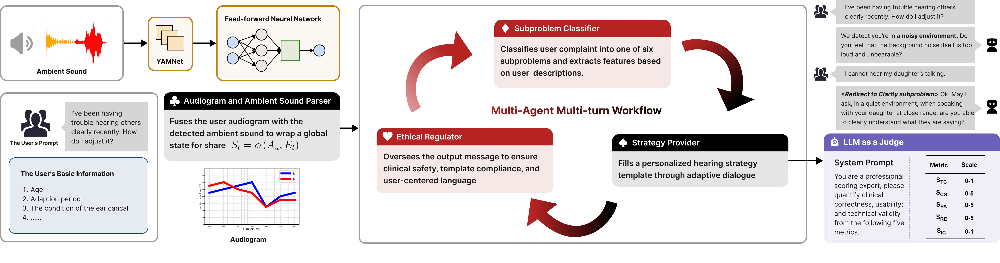

# CAFA: Context-Adaptive Hearing Aid Fitting Advisor

A multimodal AI system that provides personalized, real-time hearing aid adjustments through intelligent conversation and ambient sound awareness.

## Overview

CAFA (Context-Adaptive Fitting Advisor) addresses the limitations of traditional static hearing aid fittings by combining real-time acoustic environment classification with multi-agent Large Language Model (LLM) reasoning. The system enables users to receive expert-level hearing aid adjustments anywhere, anytime, without requiring clinical visits.

## Key Features

- **Real-time Ambient Sound Classification**: Achieves 91.2% accuracy in categorizing environments as conversation, noise, or quiet
- **Multi-Agent LLM Workflow**: Four specialized agents work together to provide safe, personalized fitting recommendations
- **Multimodal Integration**: Combines live audio, audiogram data, and user feedback for comprehensive context awareness
- **Conversational Interface**: Natural dialogue-based interaction with text-to-speech output
- **Clinical Safety**: Built-in ethical regulation and quality assurance through an LLM Judge system

## System Architecture

### Sound Recognition Pipeline
- Lightweight neural network based on YAMNet embeddings
- Transfer learning approach using MobileNetV1 architecture
- Three-class classification: conversation, noise, quiet
- Low-latency processing suitable for mobile devices

### LLM Agent Workflow

1. **Context Acquisition Agent**: Fuses user audiogram with ambient sound classification
2. **Subproblem Classifier**: Maps user complaints to six canonical fitting challenges (noise, distortion, clarity, loudness, blocked ears, howl)
3. **Strategy Provider**: Conducts slot-filling dialogue to generate personalized recommendations
4. **Ethical Regulator**: Ensures clinical safety and policy compliance

### Quality Assurance
- Independent LLM Judge evaluates conversations across five metrics
- Validates technical correctness, clinical safety, and user-centered communication

## Technical Requirements

- Bluetooth-LE compatible hearing aids
- iOS device (tested on iPhone 14 Pro)
- Audio processing: 16 kHz sampling rate
- LLM backend: GPT-4.1 and GPT-4o models
- Deployment platform: Dify v1.5.0

## Implementations
Please refer to [figures/dify-strategy.pdf](figures/dify-strategy.pdf) and [figures/strategy.pdf](figures/strategy.pdf) for the Dify orchestration implementation of one strategy for the "cannot hear" subproblem.

## Evaluation
### Metrics

| **Metric**               | **Symbol**     | **Scale** | **Evaluation criteria**                                                                                                                                                  |
|---------------------------|----------------|-----------|--------------------------------------------------------------------------------------------------------------------------------------------------------------------------|
| Template Compliance       | $S_{\text{TC}}$ | 0–1       | Fraction of *mandatory* slots that are non-null, belong to the allowed set, and satisfy all inter-slot constraints.                                                       |
| Clinical Safety           | $S_{\text{CS}}$ | 0–5       | Rubric: 5 = no safety issues; 3 = minor risk (e.g., too short adaptation); 1 = major risk (e.g., gain increase during active otitis media).                               |
| Personalization Adequacy  | $S_{\text{PA}}$ | 0–5       | Number of distinct user-specific elements (audiogram, personal info, prior feedback) referenced.                                                                          |
| Readability & Empathy     | $S_{\text{RE}}$ | 0–5       | Average of (i) readability score (Flesch ≥ 60 equivalence) and (ii) empathy score based on the CARE checklist.                                                            |
| Internal Consistency      | $S_{\text{IC}}$ | 0–1       | Detects contradictions between narrative text and structured JSON.                                                                                                        |

### Results

- **Ambient Sound Classification**: 91.2% overall accuracy
- **Conversation Efficiency**: Reduced dialogue turns from 9.4 to 6.7 with context awareness
- **LLM Judge Metrics**: High scores across all quality dimensions

## Future Development

- Expand acoustic dataset with multilingual and diverse cultural environments
- Implement adaptive prompts for personalized linguistic preferences
- Conduct large-scale human trials for clinical validation
- Optimize for edge deployment and reduced latency

## Citation
Paper to be presented at UbiComp Companion '25, October 12-16, 2025, Espoo, Finland.
